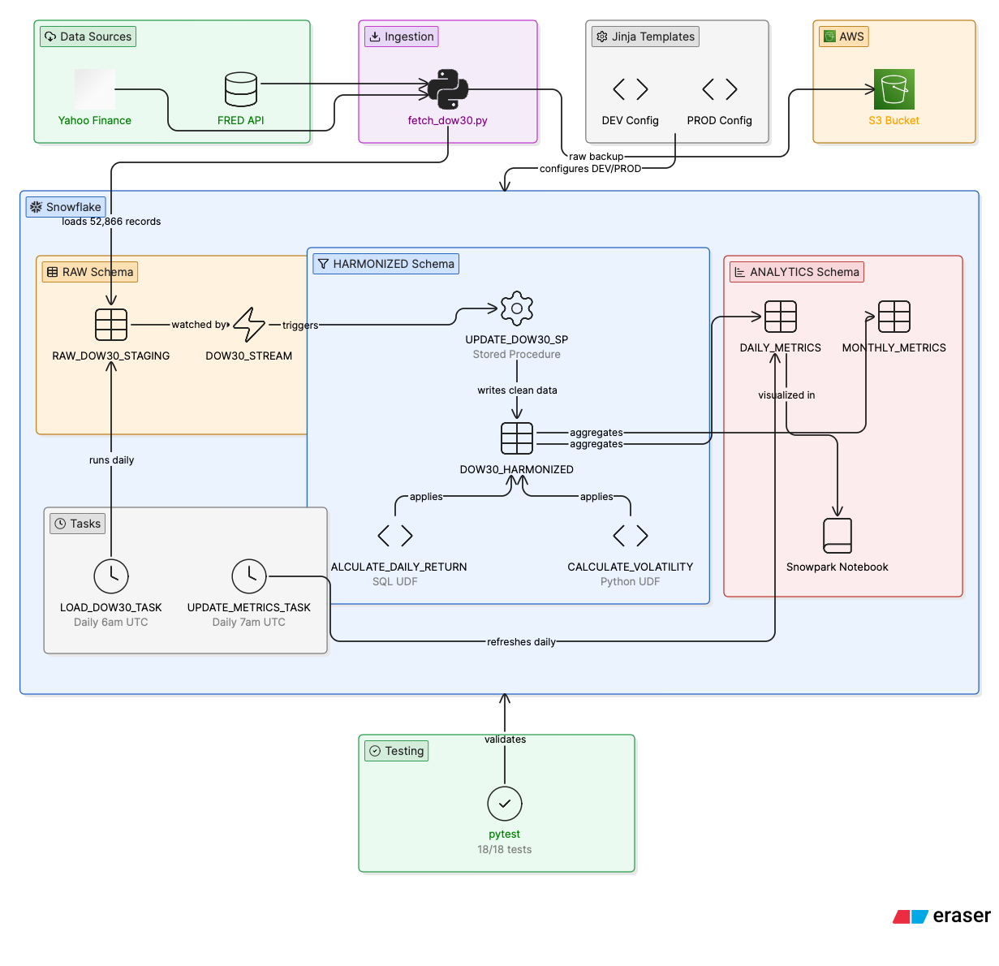

# DOW 30 Incremental Data Pipeline

An incremental data pipeline for DOW 30 stock market data built using Snowflake, Snowpark Python, FRED API and Yahoo Finance. The pipeline automatically ingests daily stock data, applies financial transformations using custom UDFs, and maintains analytics-ready tables — all orchestrated through Snowflake Tasks running on a daily schedule.

---

## Architecture



---

## What This Pipeline Does

- Fetches daily stock price data for all 30 DOW Jones Industrial Average companies from Yahoo Finance
- Fetches DJIA, S&P 500, and NASDAQ Composite index data from the Federal Reserve's FRED API
- Stores raw data in Snowflake and uses a Stream to detect new records incrementally
- Cleans and standardizes data using a Stored Procedure powered by two custom UDFs
- Computes daily return percentages and 30-day annualized volatility for every stock
- Aggregates into daily and monthly analytics tables
- Runs automatically every day via Snowflake Tasks — no manual intervention needed
- Supports DEV and PROD environments via Jinja configuration templates

---

## Dataset

| Property | Value |
|---|---|
| Stocks covered | 30 DOW Jones Industrial Average companies |
| Indices covered | DJIA, S&P 500, NASDAQ Composite |
| Total records | 52,866 stock records + 4,806 index records |
| Date range | January 2, 2020 — present |
| Trading days per ticker | 1,602 |
| Data sources | Yahoo Finance, FRED API (Federal Reserve) |

---

## Pipeline Components

| Component | Type | Description |
|---|---|---|
| `fetch_dow30.py` | Python script | Fetches data from Yahoo Finance and FRED API, loads into Snowflake |
| `RAW_DOW30_STAGING` | Snowflake table | Raw ingested data, exactly as received |
| `DOW30_STREAM` | Snowflake Stream | Tracks new inserts for incremental processing |
| `CALCULATE_DAILY_RETURN` | SQL UDF | Computes daily percentage return between two closing prices |
| `CALCULATE_VOLATILITY` | Python UDF | Computes 30-day annualized volatility using NumPy |
| `UPDATE_DOW30_SP` | Stored Procedure | Reads from Stream, applies UDFs, writes to HARMONIZED table |
| `DOW30_HARMONIZED` | Snowflake table | Cleaned, validated data with daily returns |
| `DAILY_METRICS` | Snowflake table | Per-stock daily analytics with 30-day volatility |
| `MONTHLY_METRICS` | Snowflake table | Per-stock monthly return and volatility aggregates |
| `LOAD_DOW30_TASK` | Snowflake Task | Runs stored procedure daily at 6am UTC |
| `UPDATE_DOW30_METRICS_TASK` | Snowflake Task | Refreshes analytics tables daily at 7am UTC |
| `DOW30_Snowpark_Analysis` | Snowflake Notebook | Snowpark Python visualizations and trend analysis |
| `config.yml.j2` | Jinja template | Renders DEV and PROD environment configurations |

---

## Project Structure
dow30-snowflake-pipeline/
├── data/
│   └── fetch_dow30.py              # Data ingestion script
├── snowflake/
│   ├── schemas/
│   │   ├── setup.sql               # Database, schemas, tables, stream
│   │   └── analytics.sql           # Analytics layer population
│   ├── udfs/
│   │   ├── sql_udf.sql             # Daily return SQL UDF
│   │   └── python_udf.sql          # Volatility Python UDF
│   ├── procedures/
│   │   └── update_sp.sql           # Incremental update stored procedure
│   └── tasks/
│       └── tasks.sql               # Snowflake task definitions
├── snowpark/
│   └── notebook.ipynb              # Snowpark analysis notebook reference
├── tests/
│   └── test_udfs.py                # 18 unit tests — 18/18 passing
├── jinja/
│   ├── config.yml.j2               # Jinja environment template
│   └── render_config.py            # Config renderer script
├── docs/
│   └── architecture.png            # Pipeline architecture diagram
├── requirements.txt
├── .env.example
├── AIUseDisclosure.md
└── README.md

---

## Setup Instructions

### 1. Clone the repository
```bash
git clone https://github.com/YOUR_USERNAME/dow30-snowflake-pipeline.git
cd dow30-snowflake-pipeline
```

### 2. Create virtual environment
```bash
python -m venv venv
source venv/bin/activate
pip install -r requirements.txt
```

### 3. Configure environment variables
```bash
cp .env.example .env
```
Fill in the following in your `.env` file:

SNOWFLAKE_ACCOUNT=your_account_identifier
SNOWFLAKE_USER=your_username
SNOWFLAKE_PASSWORD=your_password
SNOWFLAKE_DATABASE=DOW30_DB
SNOWFLAKE_WAREHOUSE=DOW30_WAREHOUSE
SNOWFLAKE_ROLE=ACCOUNTADMIN
FRED_API_KEY=your_fred_api_key
AWS_ACCESS_KEY_ID=your_aws_key
AWS_SECRET_ACCESS_KEY=your_aws_secret
AWS_BUCKET_NAME=dow30-pipeline
AWS_REGION=us-east-2

### 4. Set up Snowflake
Run `snowflake/schemas/setup.sql` in your Snowflake SQL worksheet to create the database, schemas, tables, and stream.

### 5. Fetch and load data
```bash
python data/fetch_dow30.py
```

### 6. Run the stored procedure
In Snowflake SQL worksheet:
```sql
CALL DOW30_DB.HARMONIZED.UPDATE_DOW30_SP();
```

### 7. Populate analytics tables
Run `snowflake/schemas/analytics.sql` in Snowflake SQL worksheet.

### 8. Activate tasks
Run `snowflake/tasks/tasks.sql` in Snowflake SQL worksheet.

### 9. Run tests
```bash
python -m pytest tests/test_udfs.py -v
```

### 10. Render environment config
```bash
python jinja/render_config.py --env dev
python jinja/render_config.py --env prod
```

---

---

## Key Results

| Metric | Value |
|---|---|
| Total records loaded | 57,672 (52,866 stocks + 4,806 indices) |
| Tickers covered | 33 (30 DOW stocks + DJIA + S&P 500 + NASDAQ) |
| Trading days per ticker | 1,602 |
| Date range | Jan 2020 — May 2026 |
| Top performer (avg monthly return) | Intel Corporation +19.02% |
| Highest volatility | Intel Corporation 0.4458 |
| Tasks running | 2 (daily at 6am and 7am UTC) |
| Tests passing | 18/18 |

---

## Technologies Used

| Technology | Purpose |
|---|---|
| Snowflake | Cloud data warehouse |
| Snowpark Python | In-warehouse Python transformations |
| Snowflake Streams | Incremental change detection |
| Snowflake Tasks | Automated daily scheduling |
| Snowflake Notebooks | Interactive Snowpark analysis |
| Yahoo Finance (yfinance) | DOW 30 stock price data |
| FRED API | Market index data (Federal Reserve) |
| Jinja2 | DEV/PROD environment configuration |
| pytest | Unit testing framework |
| AWS S3 | Raw data backup storage |

---

## Resources

- [Snowflake Snowpark Python Documentation](https://docs.snowflake.com/en/developer-guide/snowpark/python/index)
- [FRED API Documentation](https://fred.stlouisfed.org/docs/api/fred/)
- [Yahoo Finance Python Library](https://pypi.org/project/yfinance/)
- [Snowflake Streams and Tasks](https://docs.snowflake.com/en/user-guide/streams)
- [Jinja2 Documentation](https://jinja.palletsprojects.com/)
